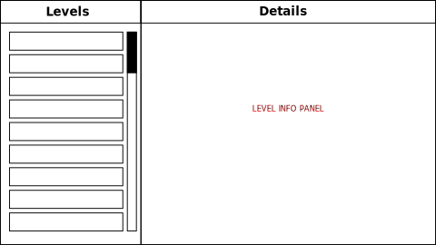
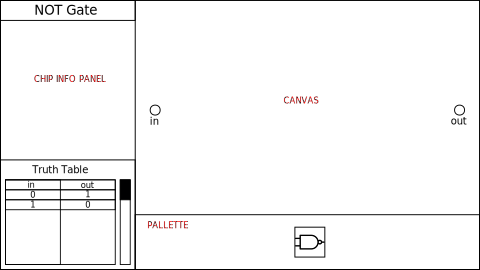

NANDy Crush
===========

A game based on the first part of the [Nand2Tetris](https://www.nand2tetris.org/) curriculum.

Gameplay
--------

The game consists of several levels, each corresponding to the creation of a particular component of the **Hack** computer system specfied in the book *[The Elements of Computing Systems](https://www.nand2tetris.org/book)*.
Players place circuit components, or "chips," into the design and connect them with wires.
Players can test their chips by clicking a "play" button, which will run a simulation in which all necessary input combinations will be tested on the player's chip design.
If all input combinations are tested successfully, the player's completion of the level will be recorded.
The player's current design will be saved in the background as they modify it (format to be specified).
In the first level, players will have access only to the NAND gate and will use it to create a NOT gate.
Each level will allow the use of the NAND gate along with all chips created by the player in previous levels.

(?) Players can complete levels out of order, so if they are stuck on a particular chip, they can still use it in the subsequent levels.

User Interface
--------------

The game has two main interfaces: the Level Menu and the Chip Designer

### Level Menu

#### Major Components:

* Level List: Shows names of available levels, which can be clicked to highlight.
* Level Info Panel: Displays information about the currently selected level in the Level List.
	- Level Name: same as what the player selects in Level List
	- (?) Flavor Text: A whimsical phrase or quotation, possibly but not necessarily compsci related, that somehow relates to the chip. Displayed in a fainter and/or smaller font underneath the Level Name
	- Brief Description: brief description of the chip and its purpose
	- Player stats: If the level has been completed, shows stats regarding the design complexity (total NAND gates in used components would be a good metric for complexity)

### Chip Designer

The Chip Designer consists of a central "canvas" or "board" area, where inputs and outputs for the current chip will be located and where the player may place chips.
In the top-right corner of the screen will be an X-shaped "close" button to close the Chip Designer and return to the Level Menu.
The player selects the type of chip they would like to place from a "pallette" area where all chips allowed for the currect level can be selected.
The designer UI also features a panel displaying the truth table for the current chip, so the player can always see the correct outputs for each combination of inputs for the chip they are working on.

#### Major Components:

* Canvas: area in which chips are placed and connected to design the current chip
* Pallette: Menu of available chips the player can select.
* Chip Info Panel: Information to help the player understand and design the chip.
	- Level Name: same as Level Name from Level Menu's Info Panel
	- Description: Describes the chip's purpose and function (possibly longer Description in Level Menu)
	- (?) Tips for completing the design (maybe start out blanked out with manual reveal?)
	- (?) References to relevant sections of *[The Elements of Computing Systems](https://www.nand2tetris.org/book)*
	- Truth table: shows the correct outputs for each combination of inputs.
		* More complex chips will have very large truth tables, so it will have to be scrolled through.
		* (?) During testing, the rows of the truth table are highlighted as the corresponding input combination is tested.

Godot Scenes Specifications
---------------------------

### `Canvas`
The canvas scene presents a grid in which `CanvasInput` scenes will be instanced on level start, and in which chips and wires can be placed.

#### Design:
The canvas scene will consist of a `ViewPortContainer` Node with a child `ViewPort`, with its own `Camera2D` so that it can be independently zoomed and scrolled.

### `CanvasInput`

Represents an input to the current chip visually on the canvas.

### Chips

Each chip will consist of
